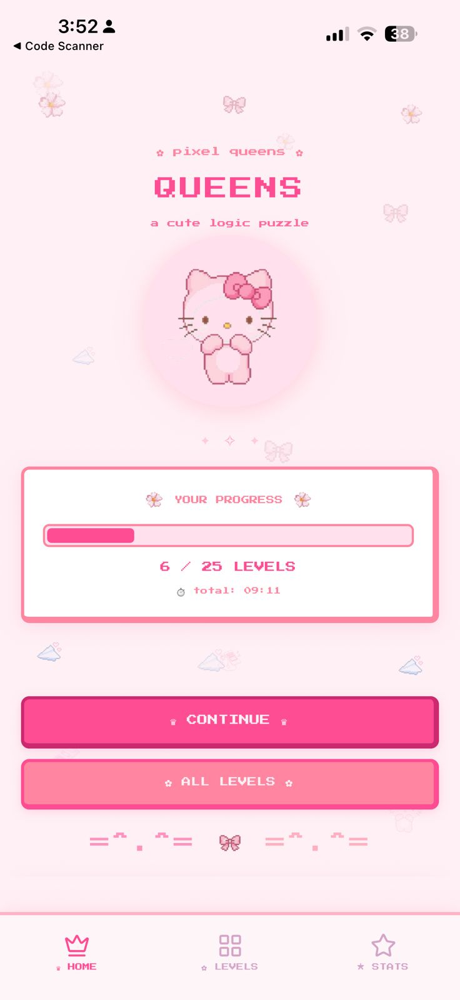
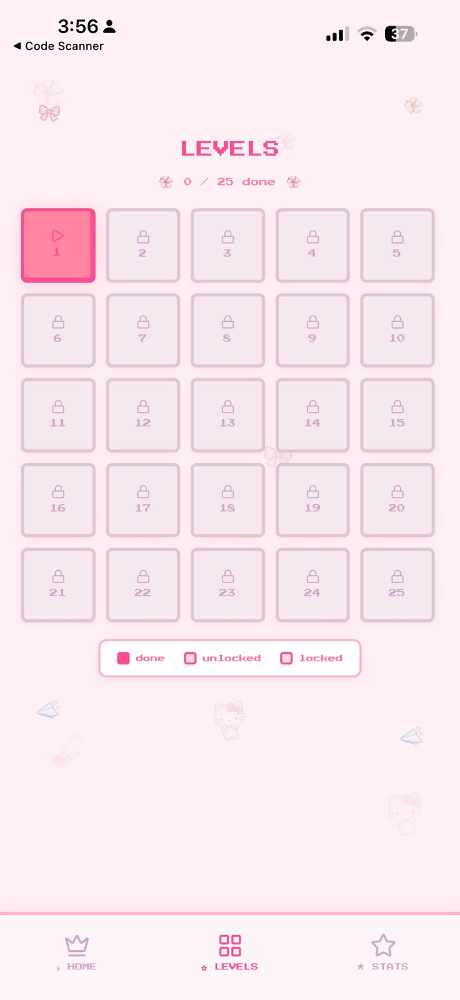
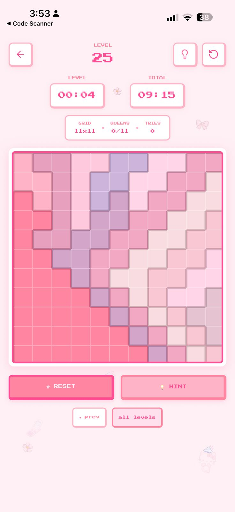
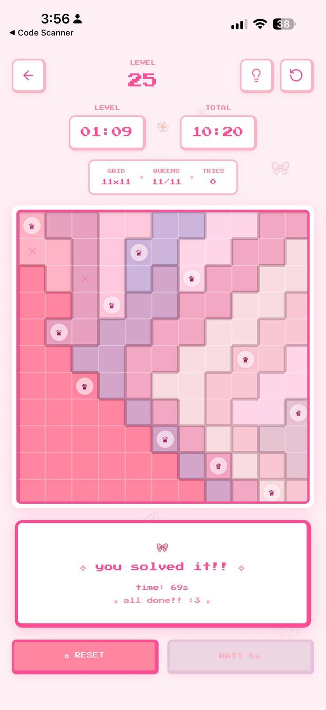
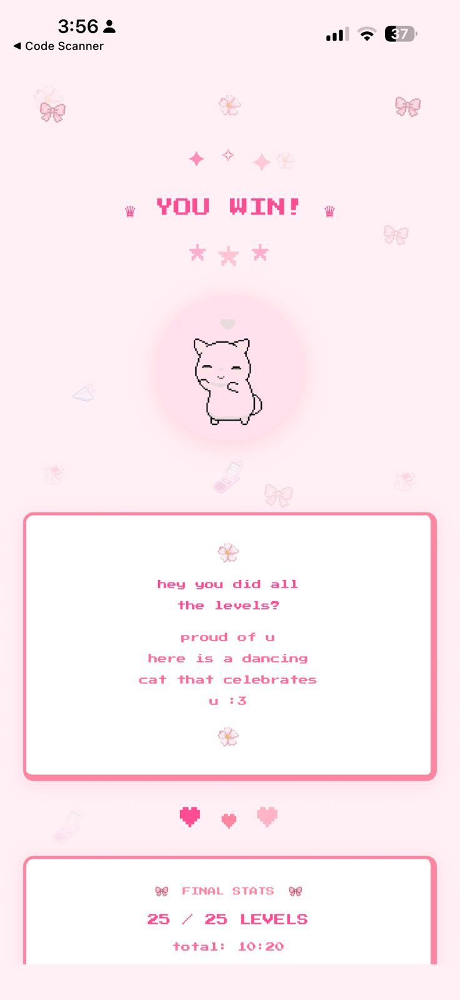
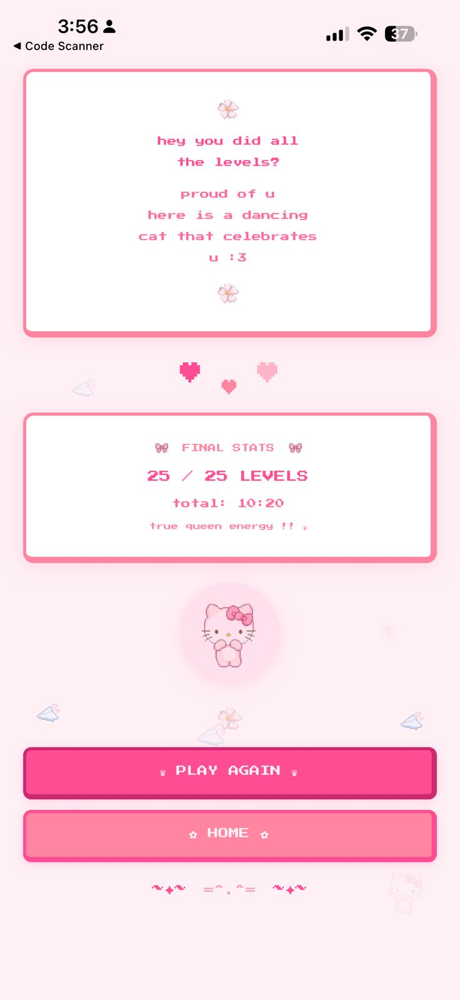
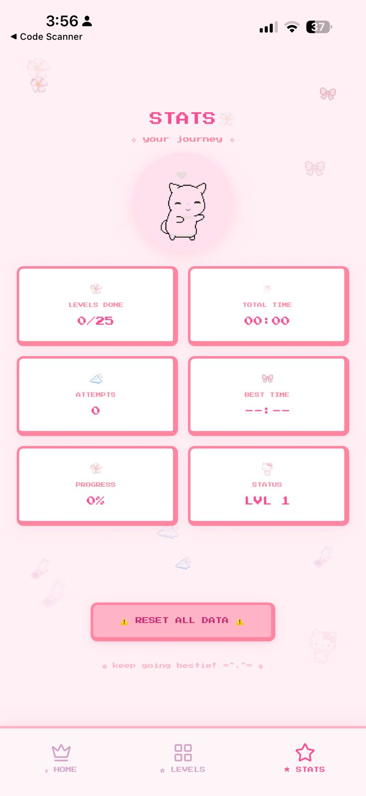

<h1 align="center">QUEENS</h1>

  

---

  

## About

A logic puzzle built on the N-Queens problem. Place one queen per color region with no shared rows, columns, or diagonals. 25 levels. Increasing difficulty. No filler.

  
  
  

---

## Screenshots

  
  
  

  
  
  

  

---

## Stats

<table align="center">
  <tr>
    <td align="center" width="140"><h2>25</h2>levels</td>
    <td align="center" width="140"><h2>11x11</h2>max grid</td>
    <td align="center" width="140"><h2>&#x23F1;</h2>timed</td>
  </tr>
</table>

---

## How to Play

<table align="center">
  <tr>
    <td align="center" width="180"><h2>&#x265B;</h2> one queen per color region</td>
    <td align="center" width="180"><h2>&#x2194;</h2> one queen per row & column</td>
  </tr>
  <tr>
    <td align="center" width="180"><h2>&#x26D4;</h2> no diagonal contact</td>
    <td align="center" width="180"><h2>&#x23F1;</h2> outpace your previous best</td>
  </tr>
</table>

---

  

## Features

- 25 hand-crafted levels with scaling grid sizes
- Per-level and cumulative timer
- Hint system
- Stats tracking: levels cleared, attempts, best times, progress
- Progressive level unlocking
- Reset anytime

---

## Screens

| Icon | Screen | Description |
|:----:|:------:|:------------:|
| &#x1F3E0; | Home | Progress bar, continue, all levels |
| &#x1F4CB; | Levels | 5x5 grid: done / unlocked / locked |
| &#x1F3AE; | Gameplay | Grid, timer, hint, reset |
| &#x1F3C6; | Win | Final stats, play again, home |
| &#x1F4C8; | Stats | Levels, total time, attempts, best time |

---

## Tips

- Start with the smallest color regions
- Use X markers to eliminate impossible cells
- Hints reveal one valid placement
- Reset is penalty-free

---

  

